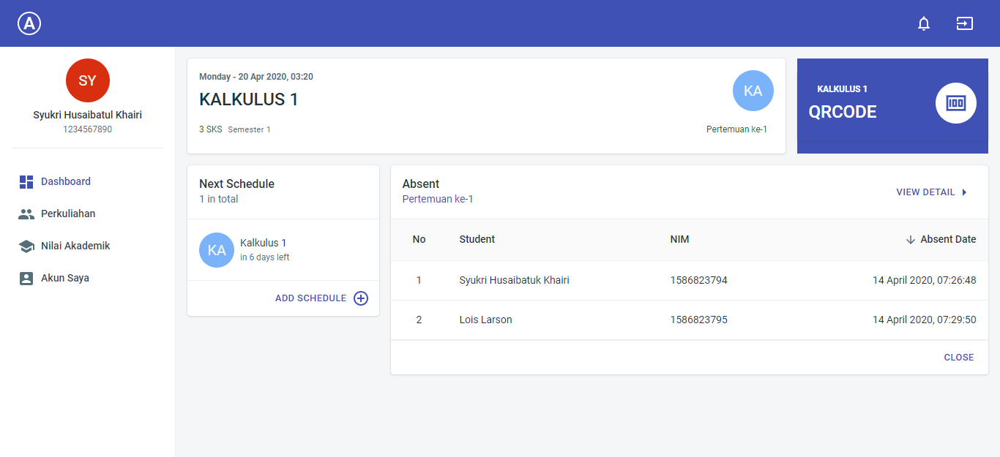

# Absent Admin Web \(Front-End\)

## Installing

Install all dependencies :

```
$ npm install
```

## Development

Run the application in development mode using this command

```bash
$ npm start
```

## Build

Build application using this command

```bash
$ npm run build
```

## Features On Progress

* [x] Login
* [x] Dashboard
* [x] Account Profile
* [ ] Schedule
* [ ] Absent

## Preview




